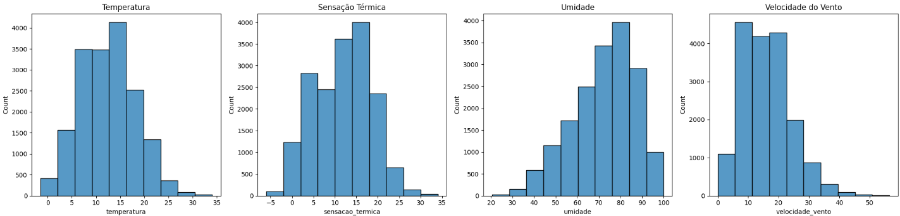
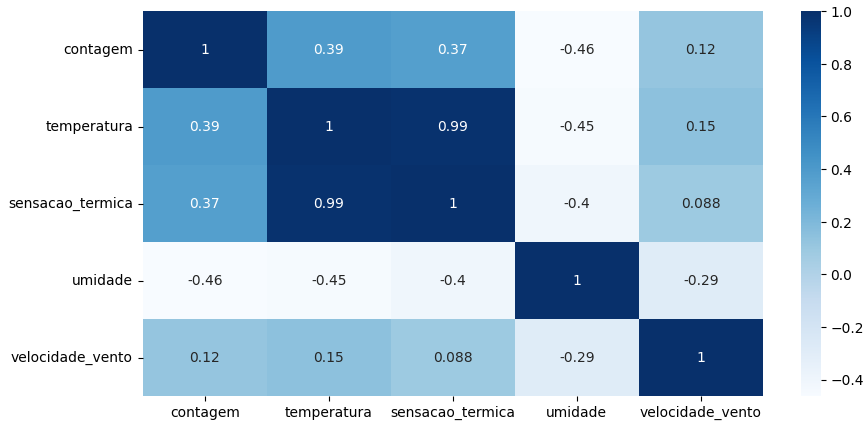
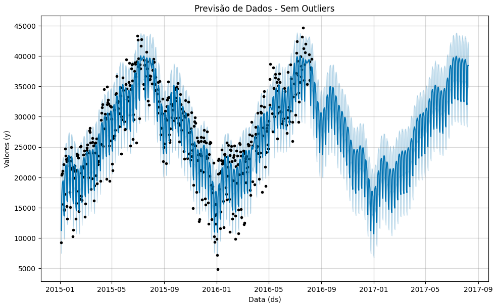

# 🚲 Previsão de Séries Temporais: Demanda de Aluguel de Bicicletas

Este projeto utiliza o algoritmo **Prophet** para analisar e prever a demanda de aluguel de bicicletas. O objetivo é entender como padrões temporais (sazonalidade) e variáveis climáticas influenciam o comportamento dos usuários.

## 📌 Explicação do Projeto

O notebook `Analisando_e_Prevendo_Series_Temporais.ipynb` implementa uma análise e modelagem preditiva, contendo:

1.  **Tratamento e Limpeza**: Carregamento dos dados e aplicação de **interpolação linear** para preencher lacunas em variáveis como temperatura e remoção de registros duplicados para evitar viés estatístico.
2.  **Análise Exploratória (EDA)**: Estudo detalhado das variáveis climáticas (umidade, vento, sensação térmica) e como elas se correlacionam com a contagem total de aluguéis.
3.  **Previsão com Prophet**: Implementação do modelo desenvolvido pela Meta (Facebook) onde é possível:
    * Identificar **sazonalidades automáticas** (diárias, semanais e anuais).
    * Lidar com feriados e eventos especiais de forma simplificada.
    * Ajustar tendências de crescimento ou queda ao longo do tempo.
4.  **Avaliação de Resultados**: Visualização das tendências extraídas e comparação entre os dados históricos e a curva de previsão.

## 📊 Visualizações e Insights

Abaixo estão os principais destaques gerados durante a análise dos dados.

### 1. Comportamento das Variáveis Climáticas
Análise da distribuição de temperatura, umidade e vento para entender o cenário meteorológico do dataset.
> 

### 2. Correlação entre as variáveis
Matriz de correlação identificando o impacto das variáveis climáticas e temporais no volume total de aluguéis de bicicletas.
> 

### 3. Previsão de Demanda (Modelo Prophet)
O resultado final do modelo, exibindo a tendência da série e as projeções futuras com intervalos de confiança.
> 

## 🛠️ Instruções de Execução do Código

### Pré-requisitos

* Python 3.11+
* Bibliotecas: `pandas`, `seaborn`, `matplotlib`, `prophet`, `scipy`

### Passo a Passo

1.  **Clone o repositório:**
    ```bash
    git clone [https://github.com/viniciusdep/Previsao_Series_Temporais.git](https://github.com/viniciusdep/Previsao_Series_Temporais.git)
    cd Previsao_Series_Temporais
    ```

2.  **Crie e ative seu ambiente virtual:**
    ```bash
    # Windows
    python -m venv venv
    .\venv\Scripts\activate
    # Linux/Mac
    python3 -m venv venv
    source venv/bin/activate
    ```

3.  **Instale as dependências:**
    ```bash
    pip install pandas seaborn matplotlib prophet scipy
    ```

